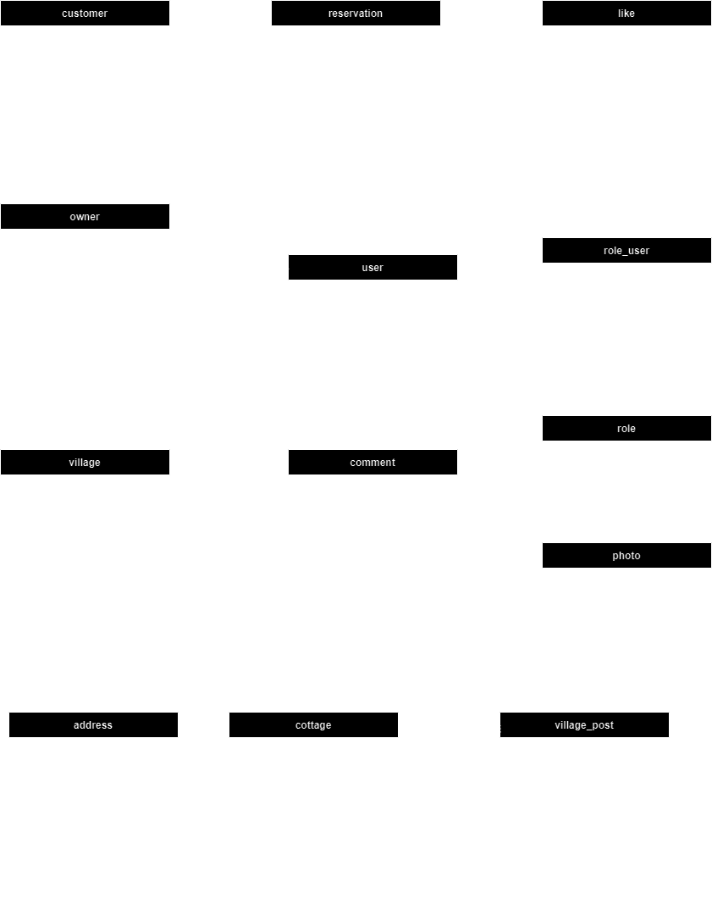

# Cottage Connect

The primary objective of the project is to design a software application intended to aid owners in enhancing the
operation
of their tourist facilities, and for their potential clients to make simple reservations for holiday cottages. Thanks to
an efficient reservation system, there's no need for any intermediaries. All participants in the system will have
different permissions depending on whether they are users or owners.

## ERD Diagram



## Features

### Functionalities for the owners

- `Add/delete/update comments for villages and cottages`
- `Retrieve all comments based on commentableId (village,cottage)`
- `Add/delete photos for user and cottages`
- `Add/delete likes for comments and village posts`
- `Confirm/delete reservations`
- `Retrieve all reservations by Cottage ID`
- `Add/delete/update villages`
- `Add/delete/update cottages`
- `Get cottage by ID`
- `Get all cottages by Village ID`
- `Add/delete/update village-posts`
- `Get village-post by ID`
- `Get all village-posts by VillageID`

### Functionalities for the customers

- `Add/delete/update comments for villages and cottages`
- `Add/delete photos for user`
- `Add/delete likes for comments and village posts`
- `Add reservations`
- `Get all reservations with status (confirmed or not)`

### Security

- JWT used for authentication and authorization, ensuring secure access to the platform.

## Getting started

1. Clone project

  ``` bash      
   git clone https://github.com/MateuszMechula/cottage-connect.git
  ```

2. Open cloned directory

  ``` bash      
   cd cottage-connect
  ```

3. Build project

  ``` bash
  ./gradlew clean build
  ```

4. Go to docker directory

  ``` bash      
   cd docker
  ```

5. Run using docker-compose

  ``` bash
  docker-compose up -d
  ```

## Technologies used

### Backend

- Spring Boot
- Spring Web
- Spring Security
- JWT for authentication and authorization
- Spring Data PostgreSQL
- Lombok
- Gradle
- Flyway
- Mapstruct

### Backend Testing

- JUnit
- Mockito
- RestAssured
- Testcontainers

### Database

- PostgreSQL

## Project Description (SWAGGER)

This project includes a fully documented API using Swagger. The API documentation can be found at the following link:

http://localhost:8080/swagger-ui/index.html

## Author

- [@Author](https://www.github.com/MateuszMechula)
